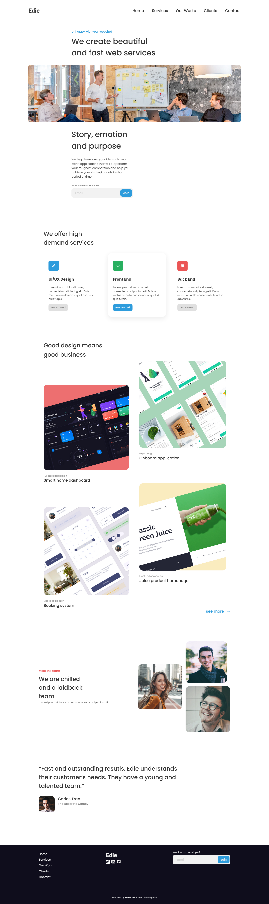

<!-- Please update value in the {}  -->

<h1 align="center">Edie Homepage</h1>

   Solution for a challenge from  <a href="http://devchallenges.io" target="_blank">Devchallenges.io</a>.

  <h3>
    <a href="https://root9259.github.io/edie-homepage/">
      Demo
    </a>
     | 
    <a href="https://github.com/root9259/edie-homepage">
      Solution
    </a>
     | 
    <a href="https://devchallenges.io/challenges/xobQBuf8zWWmiYMIAZe0">
      Challenge
    </a>
  </h3>

<!-- TABLE OF CONTENTS -->

## Table of Contents

- [Overview](#overview)
    - [Built With](#built-with)
- [Features](#features)
- [Contact](#contact)
- [Acknowledgements](#acknowledgements)

<!-- OVERVIEW -->

## Overview

The demo can be Viewed [here](https://root9259.github.io/edie-homepage/)

[//]: # (- Where can I see your demo?)

[//]: # (- What was your experience?)

[//]: # (- What have you learned/improved?)

[//]: # (- Your wisdom? :&#41;)

### Built With

<!-- This section should list any major frameworks that you built your project using. Here are a few examples.-->

this project is built with html and css

## Features

<!-- List the features of your application or follow the template. Don't share the figma file here :) -->

This application/site was created as a submission to a [DevChallenges](https://devchallenges.io/challenges) challenge.
The [challenge](https://devchallenges.io/challenges/xobQBuf8zWWmiYMIAZe0) was to build an application to complete the
given user stories.

## Acknowledgements

<!-- This section should list any articles or add-ons/plugins that helps you to complete the project. This is optional but it will help you in the future. For example -->

options select reference video can be found [here](https://www.youtube.com/watch?v=Mxw6W4MR0oU)

## Contact

- Website [Here](https://develop-naveen.netlify.app/)
- GitHub [@root9259](https://github.com/root9259)
- Twitter [@naveen_p08](https://twitter.com/naveen_p08)
